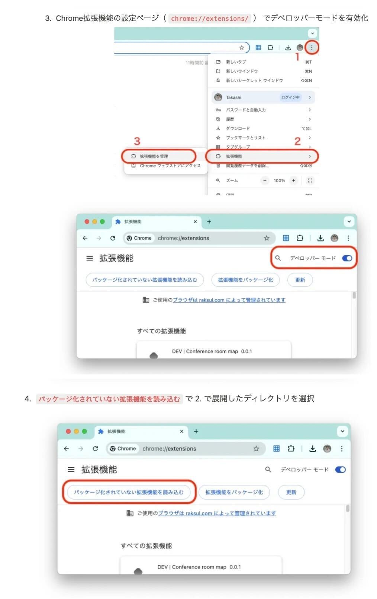

# Behalf AI Extension 使い方マニュアル

## インストール方法

1. [GitHub リポジトリ](https://github.com/KoshiOsaki/behalf-ai-extension)の右側にある「Releases」セクションから最新のリリースを確認します
2. 最新リリースページから `behalf-ai-extension-x.x.x.zip` ファイルをダウンロードします
3. ダウンロードした ZIP ファイルを任意の場所に展開します
4. Google Chrome を開き、アドレスバーに `chrome://extensions/` と入力して拡張機能ページに移動します
5. 右上の「デベロッパーモード」をオンにします
6. 「パッケージ化されていない拡張機能を読み込む」ボタンをクリックします
7. 先ほど展開した `behalf-ai-extension-x.x.x` フォルダを選択します
8. 拡張機能が正常にインストールされると、Chrome の拡張機能リストに表示されます

## 初期設定

### Gemini API キーの設定

1. 拡張機能のアイコンをクリックし、設定アイコン（⚙️）を選択します
2. 「Gemini API Key」欄に、あなたの Gemini API キーを入力します
3. 「保存」ボタンをクリックします

### Notion 連携設定（オプション）

1. 設定画面で「Notion API Secret」欄に Notion API シークレットを入力します
2. 「Notion Database ID」欄に連携したいデータベースの ID を入力します
3. 「保存」ボタンをクリックします

## 使用方法

1. Google Meet を起動します
2. 会議に参加すると、拡張機能が自動的に有効になります
3. 会議中に字幕が有効になっていない場合は、リマインダーが表示されます

### 主な機能

- **字幕履歴の表示**: 会議中の字幕がリアルタイムで収集され、サイドドロワーに表示されます
- **マークダウンエクスポート**: 収集した字幕データをマークダウン形式でエクスポートできます
- **発言候補の生成**: Gemini API を使用して、会議の文脈に基づいた適切な発言候補を生成します
- **Notion エクスポート**: 会議の字幕データを Notion データベースに直接エクスポートできます

## トラブルシューティング

- 拡張機能が動作しない場合は、Google Meet で字幕機能が有効になっているか確認してください
- API キーが正しく設定されているか確認してください
- Chrome の拡張機能ページで拡張機能を一度無効にしてから再度有効にしてみてください

## 注意事項

- この拡張機能は Google Meet の字幕機能に依存しています。字幕機能が無効の場合は正常に動作しません
- API キーは Chrome のストレージ API を使用して保存されます
